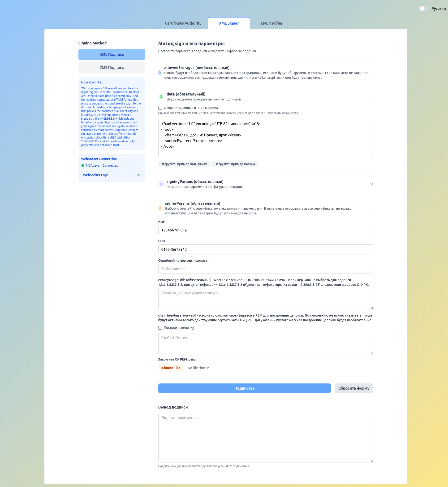

# KNCA-Signer

## Описание проекта

Проект KNCA-Signer предназначен для тестирования интеграции с KalkanCrypt и NCALayer - ключевыми компонентами
Национального удостоверяющего центра Казахстана (НУЦ). Основное назначение - создание тестовых сертификатов (корневой
сертификат, пользовательские и юридические) для демонстрации процесса работы с цифровой подписью XML-документов через
NCALayer с последующей верификацией на серверной стороне.

**Краткое описание:**
Проект позволяет выпускать тестовые сертификаты, подписывать XML-документы через NCALayer и проверять подписи на бэкенде
с использованием казахстанских криптографических стандартов (GOST 34.10-2015).

---

## Архитектура

Проект состоит из двух основных компонентов:

- **Backend** (Java 21 + Vert.x): Серверная часть для генерации сертификатов, верификации подписей и предоставления REST
  API
- **Frontend** (Alpine.js + Tailwind CSS): Веб-интерфейс для тестирования интеграции с NCALayer через WebSocket

### Backend особенности:

- Интеграция с KalkanCrypt через reflection и MVEL скрипты
- REST API для операций с сертификатами и подписями
- Генерация сертификатов CA, пользователей и юридических лиц
- Валидация XML подписей

### Frontend особенности:

- Реактивный интерфейс на Alpine.js
- Поддержка многоязычности (казахский и русский языки)
- WebSocket соединение с NCALayer (wss://127.0.0.1:13579/)
- Гибкие параметры подписи (XML, CMS, raw data)
- Фильтрация подписантов по IIN, BIN, серийному номеру

## Основные возможности

- **Генерация сертификатов:** Создание тестовых сертификатов для пользователей и юридических лиц
- **Цифровая подпись:** Подпись XML-документов через NCALayer с различными параметрами
- **Верификация подписей:** Проверка подписей на бэкенде с использованием KalkanCrypt
- **REST API:** Набор endpoints для работы с сертификатами и подписями
- **Веб-интерфейс:** Удобный интерфейс для тестирования всех функций
- **Многоязычная поддержка:** Интерфейс на казахском и русском языках



## Быстрый старт

### Backend

```bash
cd backend
./gradlew build
./gradlew run
```

### Frontend

```bash
cd frontend
npm install
npm run serve
```

Бэкенд запускается на `http://localhost:8080`, фронтенд - на `http://localhost:3000`.

## Запуск с Docker

Для быстрого запуска приложения с использованием Docker:

```bash
# Скачайте образ из GitHub Container Registry
docker pull ghcr.io/gleb619/knca-signer:latest

# Запустите с docker
mkdir -p certs lib && \
echo "WARNING: You must place the corresponding Kalkan cryptographic libraries into ./lib, or the application will not work properly." && \
docker run -d \
  --name knca-signer \
  -p 8080:8080 \
  -v "$(pwd)/certs:/app/certs" \
  -v "$(pwd)/lib:/app/lib" \
  -e APP_LOGGING_LEVEL=INFO \
  --restart unless-stopped \
  ghcr.io/gleb619/knca-signer:latest
```

**Важно:** Для работы криптографических функций необходимо наличие библиотек Kalkan в директории `lib/`. Без них
приложение будет работать в ограниченном режиме.

Приложение будет доступно на `http://localhost:8080`.

### Пример docker-compose.yml

```yaml
version: '3.8'

services:
  knca-signer:
    image: ghcr.io/gleb619/knca-signer:latest
    ports:
      - "8080:8080"
    volumes:
      - ./certs:/app/certs
      - ./lib:/app/lib
    environment:
      - APP_LOGGING_LEVEL=INFO
    restart: unless-stopped
    healthcheck:
      test: [ "CMD", "curl", "-f", "http://localhost:8080/health" ]
      interval: 10s
      timeout: 1s
      retries: 3
      start_period: 10s
```

## Предварительные требования

- **Java 21** (для backend)
- **Node.js 18+** (для frontend)
- **NCALayer** установлен и запущен локально
- **Kalkan JAR файлы** (опционально, для полной функциональности криптографии):
  - kalkancrypt-0.7.5.jar
  - kalkancrypt_xmldsig-0.4.jar
  - knca_provider_util-0.8.6.jar
  - Разместить в `backend/lib/`

## Подробная документация

- [Backend README](./backend/README.md) - Документация по серверной части
- [Frontend README](./frontend/README.md) - Документация по веб-интерфейсу

## Благодарность

Мы благодарим авторов следующих репозиториев, благодаря помощи которых было создано это приложение:

- [NCALayerJSExample](https://github.com/pkigovkz/NCALayerJSExample) - Пример HTML и JavaScript,
  показывающий, как вызывать Basics ModuleService NCALayer из браузера: загрузка локального расширения NCALayer, выбор
  сертификатов, подписание произвольных данных, верификация подписей и обработка ошибок, предоставляя разработчикам
  готовый стартер для рабочих процессов с e-ID PKI Казахстана.

- [KalkanCryptIssuanceTest](https://github.com/pkigovkz/KalkanCryptIssuanceTest) - Тесты на базе Maven,
  которые строит трехуровневую PKI (Root CA → Intermediate CA → End-entity) с использованием ключей GOST 34.10–2015
  512-bit, работу с ключами CA в PKCS#12, выпуск и валидацию цепочки сертификатов с KalkanCrypt а также запуск самих
  модульных тестов для подтверждения корректности выпуска и проверки цепочки.
